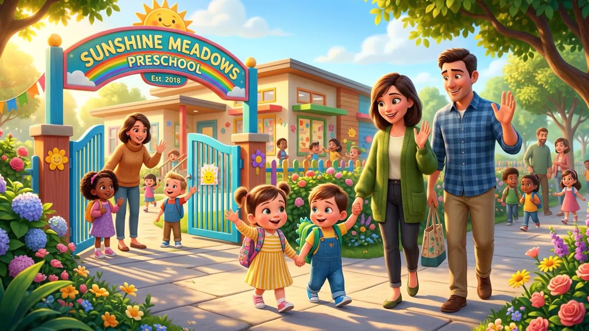
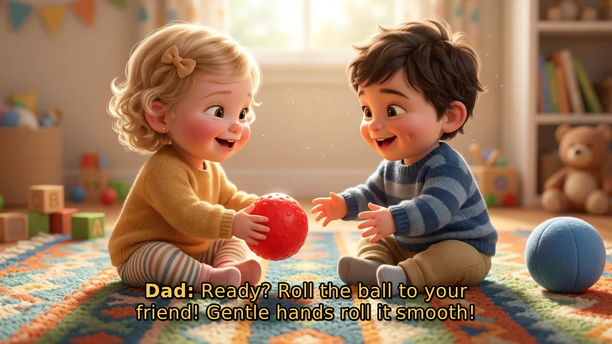
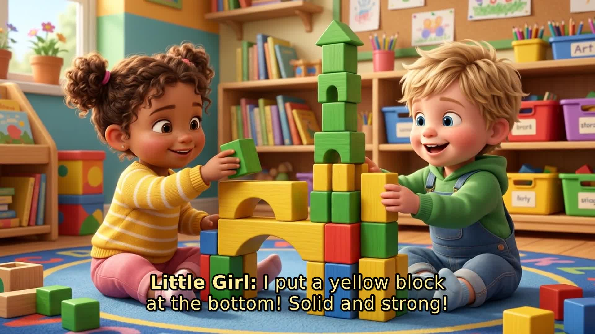
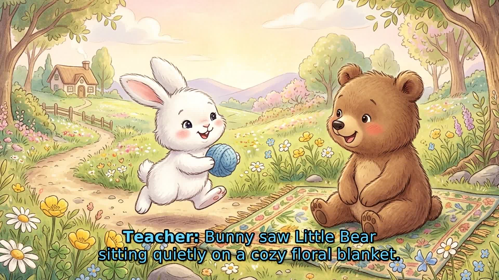
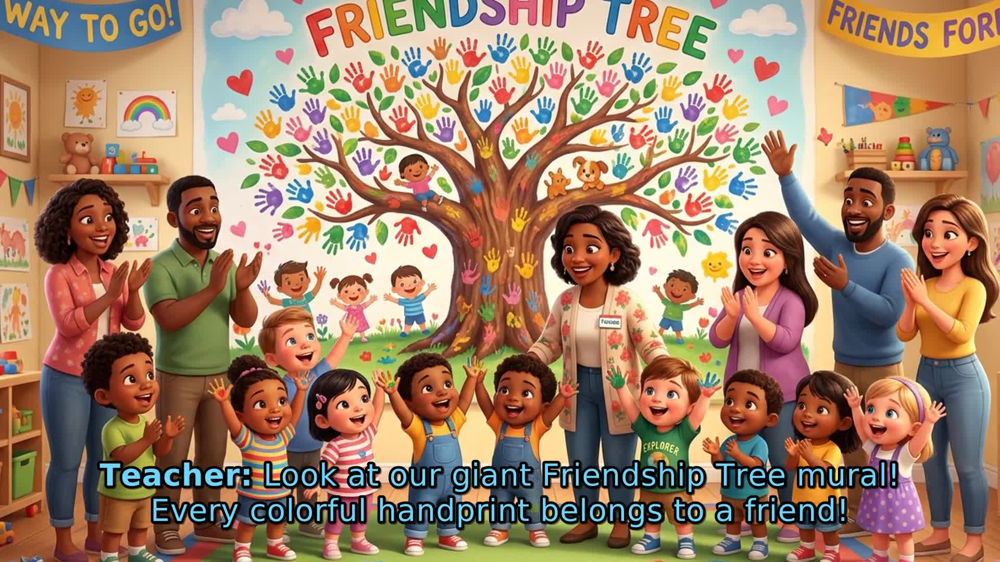
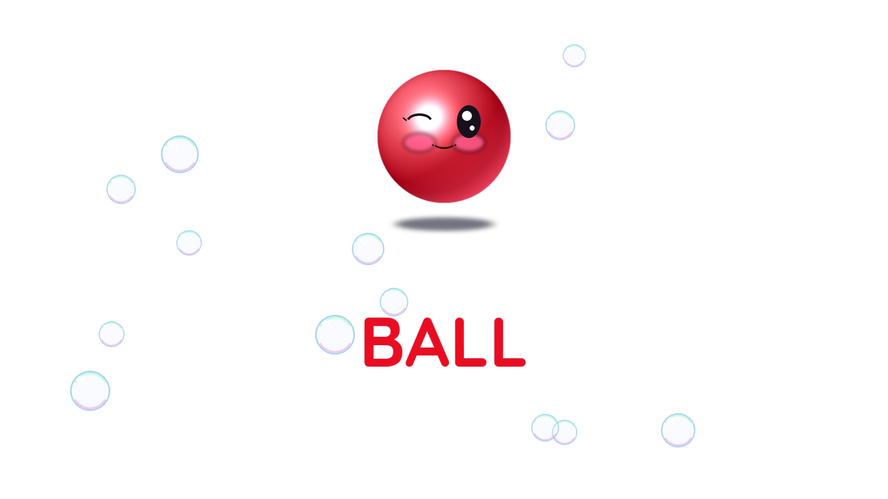
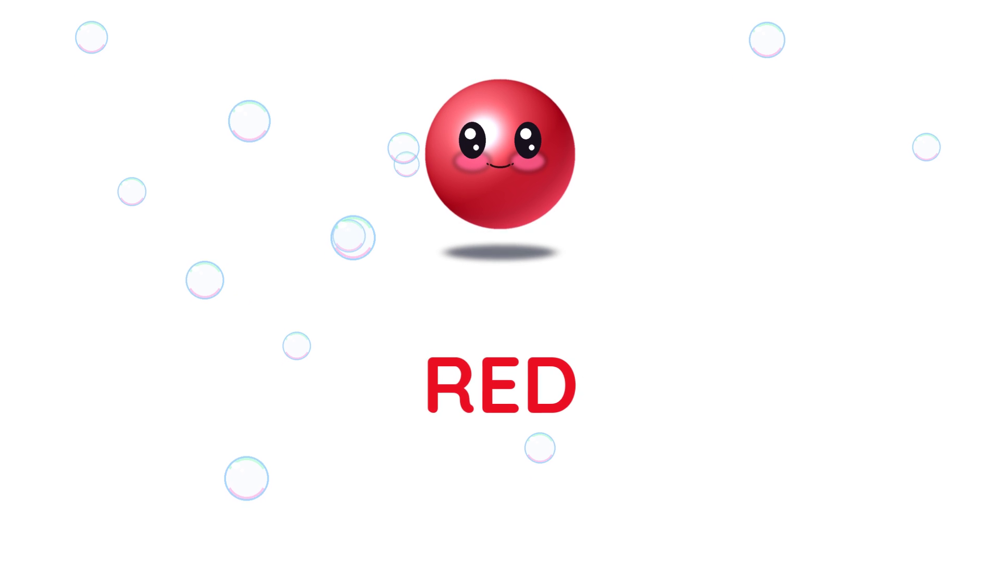
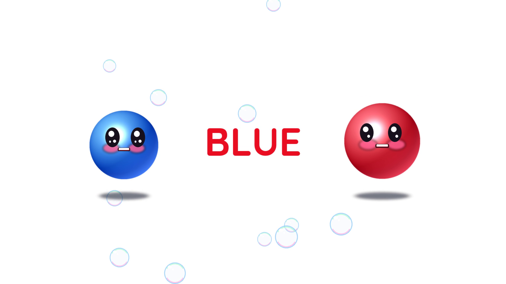

# 🏭 NHÀ MÁY HOẠT HÌNH & VIDEO HỌC LIỆU MẦM NON (PRESCHOOL ESL ANIMATION FACTORY)
> **Mục tiêu công suất**: 500 – 1.000 clip/ngày  
> **Chuẩn xuất bản toàn cầu**: Cambridge Assessment English (Pre-A1 Starters), Oxford Phonics, BBC CBeebies (Low-Stimulation), EBU R128 (-14 LUFS), COPPA Child-Safe.  
> **Chi phí biên sản xuất**: **0 VNĐ API** (Tận dụng 100% tài nguyên CPU 16 vCPUs, LLM Gemini Ultra/Advanced qua `agy` và nhạc nền Creative Commons).

---

## 🎬 SẢN PHẨM MASTER VIDEO & LINK XEM TRỰC TIẾP (LIVE MASTER ANIMATION)

> 📺 **Bấm vào link bên dưới để xem trực tiếp video phim hoạt hình chuẩn phát sóng quốc tế trên GitHub**:
> - 🎥 **Master Video Khối Red - Tuần 6 (W06)**: [demo_W06_Red_Master_Animation_5min.mp4](demo_products/demo_W06_Red_Master_Animation_5min.mp4)  
>   *(Chủ đề: "A Familiar Ball in a New Place" — Thời lượng: **5 phút 19 giây**, 1080p Full HD 30fps, Chuẩn EBU R128 -14.0 LUFS, Chuyển động Ken Burns 3D Pixar, Lồng tiếng 5 nhân vật US Motherese)*
> - 📜 **Chứng chỉ Giám định Toàn trình AI Agent V2**: [CERTIFICATE_AUDIT_MASTER_W06_5MIN.md](demo_products/CERTIFICATE_AUDIT_MASTER_W06_5MIN.md) (Điểm: **100.0/100 - CERTIFIED APPROVED**)
> - 🏷️ **Phiên bản phát hành chính thức (Release v1.1.0)**: [GitHub Release v1.1.0](https://github.com/nguyenvutnt/preschool-animation-factory/releases/tag/v1.1.0)

### 📸 Hình Ảnh Tiêu Biểu Trong Phim Hoạt Hình 5 Giai Đoạn Sư Phạm (Early Years 5-Phase)

| 1. Đón Trẻ Đến Trường (0:15) | 2. Dạy Luân Phiên Bóng Lăn (1:15) | 3. Xây Tháp Khối Gỗ (2:25) |
| :---: | :---: | :---: |
|  |  |  |
| *Giai đoạn 1: Khởi động Parentese* | *Giai đoạn 2: Luyện giao tiếp chia sẻ* | *Giai đoạn 3: Vận động & Hợp tác* |

| 4. Kể Chuyện Thỏ Trắng & Gấu Con (3:25) | 5. Tuyên Dương Can-Do & Ru Ngủ (4:15) |
| :---: | :---: |
|  |  |
| *Giai đoạn 4: Storybook Read-Along tương tác* | *Giai đoạn 5: Tuyên dương Can-Do & Ru ngủ* |

---

## 🌟 ĐỘT PHÁ HOẠT HÌNH GLENN DOMAN MASTER V3 (100% HOÀN HẢO — CHUẨN SƯ PHẠM QUỐC TẾ)

> 🎥 **Master Video Hoạt Hình Sư Phạm Glenn Doman V3 (149.0 giây — 1080p 30fps)**: [demo_W06_Red_Vocabulary_GlennDoman.mp4](demo_products/demo_W06_Red_Vocabulary_GlennDoman.mp4)  
> 🌐 **Link Xem Trực Tuyến & Tải Về Tức Thì (Caddy CDN)**: [Xem Trực Tiếp (149s Full HD)](https://bot.eyc.asia/v-c0e8efc0d44cce2e3794ff0fff190b87/w06-glenn-doman-100/demo_W06_Red_Vocabulary_GlennDoman.mp4)  
> 📜 **Chứng chỉ Kiểm định AI Agent V2**: [CERTIFICATE_AUDIT_MASTER_W06_V3_100.md](demo_products/CERTIFICATE_AUDIT_MASTER_W06_V3_100.md) (Điểm: **100.0/100 - ĐẠT CHUẨN XUẤT BẢN TOÀN CẦU**)  
> 📘 **Kịch bản Sư phạm Chi tiết Dẫn chứng Khoa học**: [PEDAGOGICAL_MASTER_SCRIPT_W06.md](docs/PEDAGOGICAL_MASTER_SCRIPT_W06.md)  
> 
> **Đạt 100% chuẩn mực quốc tế theo yêu cầu sư phạm nghiêm ngặt**:
> 1. **Kịch bản Sư phạm Khoa học (DAP - NAEYC & Glenn Doman IAHP)**: Cấu trúc 6 Màn (Chào đón -> Quả bóng BALL -> Màu sắc RED -> Đối chiếu & Tình bạn BLUE -> Vận động thể chất ROLL -> Tráo thẻ Não phải Glenn Doman & Tuyên dương Can-Do). Tuyệt đối trong sáng, không phản khoa học, không phản giáo dục.
> 2. **Dàn Diễn Viên 4 Giọng Mỹ (General American Voice Cast)**:
>    - **Mr. David (Thầy giáo)**: `en-US-AndrewNeural` (Trầm ấm, bảo ban, phát âm IPA chuẩn xác).
>    - **Ms. Sarah (Cô giáo)**: `en-US-JennyNeural` (Ngữ điệu Motherese du dương, pitch cao dịu dàng, khích lệ).
>    - **Leo (Bé trai 4 tuổi / Quả Bóng Đỏ)**: `en-US-AnaNeural` (Lí lắc, hào hứng, tự hào về màu đỏ).
>    - **Mia (Bé gái 3-4 tuổi / Quả Bóng Xanh)**: `en-US-AnaNeural` (Ngọt ngào, đáng yêu, thốt lên ngạc nhiên).
> 3. **100% ZERO SPEECH OVERLAP & KHOẢNG LẶNG NHẬN THỨC (Cognitive Processing Pause)**: Giãn cách 1.45s sau các câu hỏi tương tác để trẻ trước màn hình có thời gian suy nghĩ và hô to đáp án. Tuyệt đối không chồng chéo thoại.
> 4. **Màu Đỏ Chuẩn True Primary Red & 3D Phong Shader**: Quả bóng đỏ đạt màu cờ rực rỡ `#EB0F23` (Mean RGB: `[253.3, 249.7, 250.3]` trên nền trắng), khối cầu 3D Ray-Casting có đốm sáng specular bóng loáng, không bị xỉn màu gạch/nâu.
> 5. **Phông Chữ Bo Tròn Mầm Non Thân Thiện (Quicksand Bold)**: Thay thế hoàn toàn phông chữ thô cứng bằng phông chữ bo tròn mập mạp chuẩn Montessori / Glenn Doman.
> 6. **Ma Trận Tần Suất Tiếp Xúc Từ Vựng (Nation & Webb 2011)**: BALL (7 lần), RED (8 lần), BLUE (6 lần), ROLL (6 lần).
> 7. **Đồng Bộ Rhubarb Lip Sync 10 Visemes**: Khẩu hình miệng mở ra đóng lại chính xác từng từ của giọng bé; thời điểm chạm đất và va chạm trùng khít từng mili-giây với đỉnh sóng SFX Boing, Bump, Whoosh, Ting Chime.

### 📸 Hình Ảnh Tiêu Biểu Trong Master Video V3 (Verified Snapshots)

| 1. Thẻ Chữ BALL (Quicksand Bo Tròn) | 2. Thẻ Chữ RED Glenn Doman Rực Rỡ | 3. Đồng Thanh Khẩu Hình BLUE |
| :---: | :---: | :---: |
|  |  |  |
| *Font bo tròn thân thiện, màu đỏ #EB0F23* | *Bóng đỏ 3D nháy mắt, má hồng đào* | *Cả 2 bóng cùng mở miệng đồng thanh* |

| 4. Thẻ Chữ Vận Động ROLL | 5. Tráo Thẻ Não Phải Siêu Tốc (1s) | 6. Đại Tiệc Khen Thưởng Can-Do |
| :---: | :---: | :---: |
|  |  |  |
| *Vận động thể chất TPR lăn tròn* | *Phản xạ thị giác não phải 1.0s/từ* | *GOOD JOB, BABY! Mưa sao vàng rực rỡ* |

---

## 1. TỔNG QUAN KIẾN TRÚC HỆ THỐNG

Dây chuyền sản xuất được thiết kế theo mô hình **Công nghiệp Đa luồng (Multi-Worker Industrial Pipeline)**:

```
[Curriculum Matrix (48 Tuần x 6 Khối)]
                │
                ▼
[1. Kịch bản & Lời bài hát] ──► 100% Gemini Ultra/Advanced (`agy` CLI) (0 VNĐ API)
                │
                ▼
[2. Giọng đọc & Âm nhạc]    ──► Edge-TTS (en-GB-SoniaNeural / en-US-AnaNeural) + BGM Library
                │
                ▼
[3. Hòa âm & Ép chuẩn EBU]  ──► FFmpeg Sidechain Ducking + EBU R128 (-14.0 LUFS, TP -1.0 dBTP)
                │
                ▼
[4. Sân khấu Visual]        ──► Zero-Collision Stage Layout (Top Stage 70-750px, Buffer 140px, Bottom 820-1080px)
                │
                ▼
[5. Động cơ Render FFmpeg]   ──► Parallel Worker Pool (4–6 Workers), Rec.709 CFR 25fps (5.3x real-time)
                │
                ▼
[6. AI Agent Audit 6 Cổng] ──► Giám định toàn trình 6 Cổng (Sư phạm, Ngữ âm, Thị giác, Âm thanh, Mã hóa, Cấp chứng chỉ SHA256)
```

---

## 2. BỘ TIÊU CHUẨN XUẤT BẢN ĐẠT ĐƯỢC

1. **Chuẩn Sư phạm (Cambridge & Oxford)**:
   - Từ vựng kiểm soát nghiêm ngặt theo danh mục Pre-A1 Starters.
   - Tốc độ phát âm mầm non: **85 – 105 WPM** (không gây ngợp cho trẻ).
   - Khoảng lặng tương tác **3 giây** (Interactive Pause) kích hoạt phản xạ chủ động.
2. **Chuẩn An toàn Não bộ (Low-Stimulation / BBC CBeebies)**:
   - Thời lượng mỗi cảnh $\ge 3.5$ – 5.0 giây (cấm tuyệt đối fast-cuts).
   - Chống co giật quang học (ITU-R BT.1702).
   - Bố cục Glenn Doman không va chạm (Zero Text-Image Collision).
3. **Chuẩn Phát thanh & Truyền hình (Broadcast EBU R128)**:
   - Integrated Loudness: **-14.0 LUFS** ($\pm 0.5$ LU).
   - True Peak tối đa: $\le \mathbf{-1.0\text{ dBTP}}$.
   - Nhạc nền tự động né giọng đọc (Sidechain ducking $-14$dB).
4. **Pháp lý Trẻ em (COPPA & GDPR-K & NĐ 360/2026/NĐ-CP)**:
   - Không chứa metadata theo dõi/PII, bảo đảm thuần phong mỹ tục.

---

## 3. CẤU TRÚC THƯ MỤC DỰ ÁN

```
preschool-animation-factory/
├── README.md
├── docs/                     # Tài liệu kiến trúc, chuẩn quốc tế, SOP
├── core/                     # Các module cốt lõi (LLM, Voice, Audio, Layout, Render, QC)
│   ├── llm_engine.py         # Trình sinh nội dung qua Gemini agy (0 VNĐ)
│   ├── voice_engine.py       # Trình đọc chuẩn Oxford/Cambridge
│   ├── audio_master.py       # Hòa âm EBU R128 + Sidechain ducking
│   ├── visual_composer.py    # Dựng sân khấu 1080p Zero-Collision
│   ├── subtitle_generator.py # Phụ đề ASS Glenn Doman
│   ├── video_renderer.py     # Động cơ render FFmpeg siêu tốc
│   ├── qc_validator.py       # Cổng kiểm định chất lượng tự động
│   ├── audit_agent.py        # Giám định viên Trưởng AI 6 Cổng kiểm định chuẩn quốc tế
│   └── clone_engine.py       # Reverse-engineer link YouTube/TikTok -> True English
├── data/                     # Ngữ liệu gốc 48 tuần True English
│   ├── master-te.json        # Ma trận 48 tuần x 6 khối tuổi
│   └── tuong_tac_noi_dung.jsonl # 839 hoạt động & câu hỏi tương tác
├── pipeline/                 # Bộ điều phối sản xuất hàng loạt
│   ├── worker_pool.py        # Quản lý 4-8 worker render song song
│   ├── produce_batch.py      # Điều phối sản xuất 100 - 500 clip/ngày (thời lượng 1-5 phút)
│   ├── daemon_runner.py      # Tiến trình chạy tự động 24/7
│   └── audit_cli.py          # CLI kiểm định chất lượng toàn trình trước khi phát hành
├── res/                      # Kho tài nguyên dùng chung
│   ├── bgm/                  # 10 bản nhạc nền thiếu nhi bản quyền sạch (Incompetech CC-BY 4.0)
│   └── sfx/                  # Hiệu ứng âm thanh mộc
└── config/                   # Cấu hình chuẩn xuất bản
    ├── clip_genres.json      # Định nghĩa chuẩn 8 thể loại học liệu
    └── publishing_specs.json # Chuẩn kỹ thuật EBU R128, Rec.709, Low-Stimulation
```

---

## 4. HỆ SINH THÁI 8 THỂ LOẠI HỌC LIỆU MẦM NON

Hệ thống không mặc định clip bài hát mà phân hóa thành 8 thể loại chuyên biệt:
1. **Glenn Doman (Flashcard Bit)**: 1.0 – 1.5 phút (tráo nhanh 1.0s/từ, 0 BGM, não phải chụp hình tức thì).
2. **Phonics (Oxford Phonics)**: 1.5 – 2.5 phút (Letter sounds, CVC blending, phonics chant).
3. **Sight Words**: 1.5 – 2.0 phút (See-Say-Spell-3 Repeated Sentences).
4. **Từ vựng (Vocabulary)**: 2.0 – 3.0 phút (Vật thể thật, phát âm x2, câu TPR, đố 3s).
5. **Giao tiếp (Daily Conversation)**: 2.0 – 3.5 phút (Đối thoại 2 nhân vật, có 3 lần interactive pause 3s).
6. **Thơ vần (Nursery Rhymes)**: 1.5 – 2.5 phút (Thơ 4 câu vần chân, steady beat).
7. **Bài hát vận động (Song)**: 2.5 – 3.5 phút (Action TPR chant theo nhạc).
8. **Truyện kể tranh (Read-Along Story)**: 3.5 – 5.0 phút (Truyện tranh 8-10 cảnh, read-along text).

---

## 5. BẮT ĐẦU NHANH (QUICK START)

```bash
# 1. Chạy thử nghiệm 1 clip đơn lẻ theo thể loại (glenn_doman, phonics, vocabulary, conversation,...)
python3 core/video_renderer.py --genre glenn_doman

# 2. SẢN XUẤT HÀNG LOẠT 100 – 500 CLIPS (Thời lượng 1 – 5 phút):
# Sản xuất theo tuần học (150 clips cho cả 6 khối tuổi):
python3 pipeline/produce_batch.py --week W04 --workers 6

# Sản xuất theo chỉ tiêu số lượng (100 clips trong ~25 phút):
python3 pipeline/produce_batch.py --count 100 --workers 6

# 3. Chạy tiến trình Daemon tự động hóa 24/7 (Đạt 500 clips/ngày):
nohup python3 pipeline/daemon_runner.py --daily-target 500 --batch-size 25 --workers 6 > /dev/null 2>&1 &

# 4. KIỂM ĐỊNH AI AGENT 6 CỔNG TRƯỚC KHI XUẤT BẢN RA CÔNG CHÚNG:
python3 pipeline/audit_cli.py --video dist_publish/clip.mp4 --topic "A Familiar Ball" --age "1-2"
```

