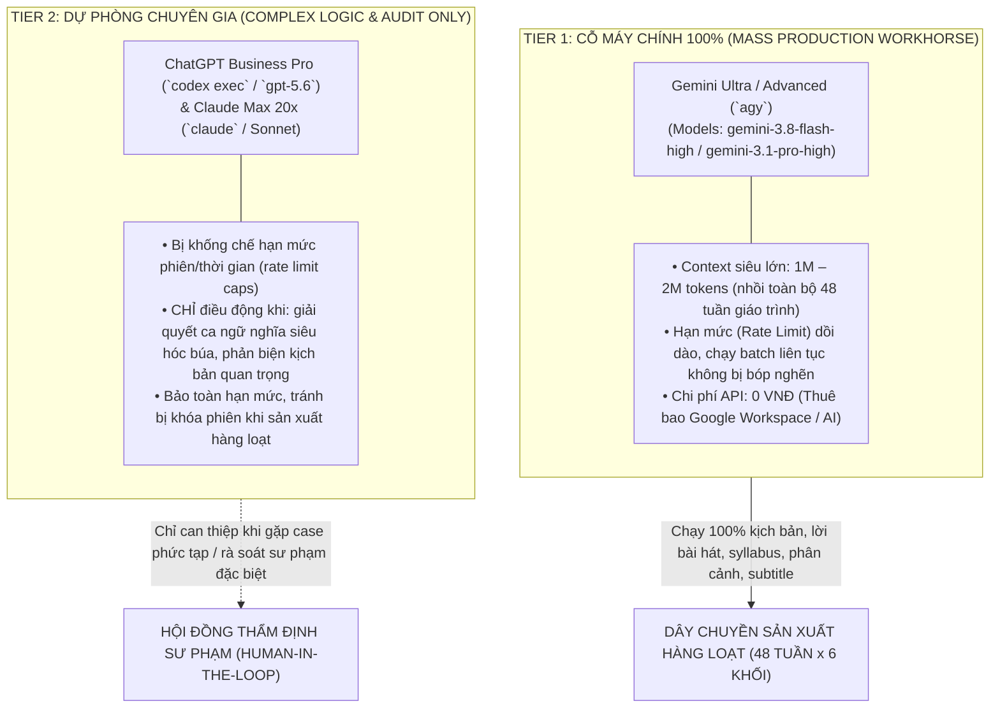

# CHIẾN LƯỢC ĐIỀU PHỐI LLM CHO NHÀ MÁY NỘI DUNG MẦM NON (PRESCHOOL FACTORY)
**Nguyên tắc tối thượng:** Tối ưu hóa chi phí vận hành (Zero Marginal API Cost) & Tối đa hóa công suất thông lượng (Throughput)

---

## 1. PHÂN CẤP TÀI NGUYÊN AI TRÊN MÁY CHỦ (TIERED MODEL STRATEGY)

Hệ thống hạ tầng máy chủ đã có sẵn các gói thuê bao trả phí trọn gói hàng tháng. Việc phân định vai trò các mô hình như sau:



---

## 2. SO SÁNH VÀ LÝ DO LỰA CHỌN GEMINI ADVANCED/ULTRA LÀM CHỦ LỰC (100%)

| Đặc tính kỹ thuật | **Gemini Ultra/Advanced (`agy`)** *(Chủ lực 100%)* | **ChatGPT Pro (`codex`) & Claude Max (`claude`)** *(Dự phòng)* |
| :--- | :--- | :--- |
| **Cửa sổ ngữ cảnh (Context Window)** | **1.000.000 – 2.000.000 tokens** *(Đủ nhồi toàn bộ từ điển âm vị, 48 tuần khung năng lực CEFR Pre-A1 và toàn bộ IP Bible)* | 128k – 200k tokens *(Chỉ vừa cho từng tuần lẻ)* |
| **Hạn mức tần suất (Rate Limits)** | **Rất cao, thông lượng mượt mà**, không bị chặn gián đoạn khi chạy lặp daemon 30-50 video liên tục | **Bị giới hạn chặt chẽ** (ví dụ: số lượt/3-5 giờ hoặc usage limit/tuần; chạm trần sẽ bị pause hàng giờ) |
| **Tốc độ sinh (Throughput)** | Cực nhanh với dòng **Gemini 3.8 Flash (High)**; sâu sắc với **Gemini 3.1 Pro** | Rất mạnh nhưng độ trễ reasoning dài, dễ cạn quota nếu ép làm việc hàng loạt |
| **Chi phí biên (Marginal Cost)** | **0 VNĐ** *(Tận dụng gói có sẵn)* | **0 VNĐ** *(Tận dụng gói có sẵn nhưng cần giữ hạn mức)* |
| **Chế độ chạy dòng lệnh (Headless)** | `agy -p "<prompt>" --model gemini-3.8-flash-high` chạy tức thì, output sạch, script dễ bắt kết quả | `codex exec` chạy ổn nhưng tốn reasoning token nhanh |

---

## 3. CHUẨN HÓA MÃ NGUỒN PIPELINE SỬ DỤNG `agy` KHÔNG TỐN TIỀN

Tích hợp vào thư viện `truelearning` bằng module gọi trực tiếp `agy`:

```python
import subprocess
from typing import Optional

def sinh_noi_dung_gemini(prompt: str, model: str = "gemini-3.8-flash-high") -> str:
    """
    Sinh kịch bản, lời bài hát mầm non tự động bằng Gemini Ultra/Advanced qua agy CLI.
    Chi phí: 0 VNĐ. Khả năng chịu tải: Cực lớn, không lo bị bóp rate-limit.
    """
    cmd = [
        "agy", "-p", prompt,
        "--model", model,
        "--output-format", "text"
    ]
    result = subprocess.run(cmd, capture_output=True, text=True, check=True)
    return result.stdout.strip()
```

---

## 4. MA TRẬN PHÂN CHIA NHIỆM VỤ THỰC TẾ

1. **Sinh kịch bản 48 tuần x 6 khối tuổi (288 kịch bản)**: **100% Gemini (`agy`)**.
2. **Sinh lời bài hát đồng dao, vần điệu Phonics (Rhymes & Melodic Words)**: **100% Gemini (`agy`)**.
3. **Phân rã Prompts ảnh theo công thức Trinity Visual**: **100% Gemini (`agy`)**.
4. **Khi nào dùng ChatGPT (`codex`) / Claude (`claude`)**:
   - Khi cần phân tích xung đột sư phạm phức tạp giữa khung giáo dục của Bộ GD&ĐT / Nghị định 360/2026 với giáo trình nước ngoài.
   - Khi cần viết các script logic phức tạp điều khiển FFmpeg, Blender hoặc Sequencer.
   - Khi có khúc mắc đặc biệt về cấu trúc âm điệu cần 2 mô hình đối chất, kiểm chứng chéo.
