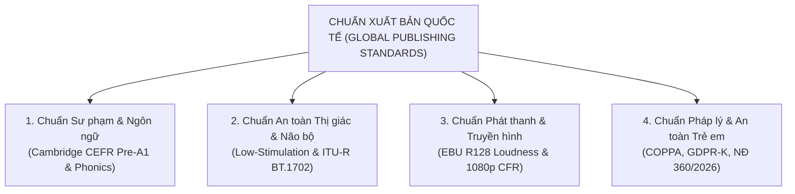
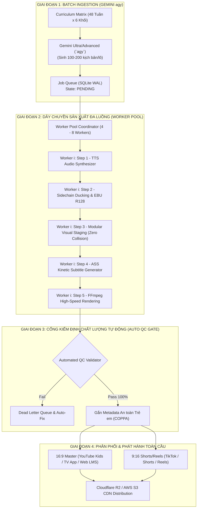

# BẢN NGHIÊN CỨU KỸ THUẬT & THIẾT KẾ KIẾN TRÚC TOÀN DIỆN
## NHÀ MÁY SẢN XUẤT 500 – 1.000 CLIP/NGÀY ĐẠT CHUẨN XUẤT BẢN QUỐC TẾ
*(Global Publishing Standards: Cambridge, Oxford, BBC CBeebies, EBU R128, COPPA)*

---

## 1. BỘ TIÊU CHUẨN XUẤT BẢN QUỐC TẾ (GLOBAL PUBLISHING BENCHMARKS)

Để một clip được các nhà xuất bản hàng đầu (Oxford University Press, Cambridge Assessment English, Pearson, Scholastic) và các mạng lưới thiếu nhi uy tín (BBC CBeebies, PBS Kids, Moonbug) chấp thuận phát hành, sản phẩm phải vượt qua **4 trụ cột tiêu chuẩn bắt buộc**:



### 1.1. Chuẩn Sư phạm & Ngôn ngữ học (Linguistic & Pedagogical Standards)
* **Khung năng lực cốt lõi**: Khớp 100% với danh mục từ vựng **Cambridge English: Young Learners (Pre-A1 Starters)** và **Oxford Phonics World**.
* **Tốc độ phát âm (Speech Pace / WPM)**:
  * Lứa tuổi 1.5 – 3 tuổi (Toddlers): **85 – 100 WPM** (từ ngữ chậm rãi, rõ nguyên âm).
  * Lứa tuổi 3 – 5 tuổi (Preschoolers): **100 – 115 WPM**.
  * *(Tuyệt đối không dùng tốc độ hội thoại người lớn 150 – 180 WPM khiến trẻ bị ngợp)*.
* **Độ chính xác âm vị & Giọng chuẩn bản xứ (Phonetic Accuracy)**:
  * 100% giọng chuẩn **Received Pronunciation (Anh - Anh chuẩn)** hoặc **General American (Anh - Mỹ chuẩn)**, không pha tạp tạp âm, âm đuôi (*final sounds: /s/, /t/, /k/, /d/*) phải phát âm rõ nét.
* **Khoảng dừng tương tác (Interactive 3-Second Pause)**:
  * Đặt nhịp ngừng 2.5 – 3 giây sau câu hỏi/từ khóa để kích hoạt phản xạ tiếp nhận chủ động của trẻ.

### 1.2. Chuẩn An toàn Não bộ & Công thái học Thị giác (Cognitive Ergonomics & Visual Safety)
* **Triết lý Low-Stimulation (Gentle Animation - Học theo BBC CBeebies & Fred Rogers)**:
  * **Độ dài tối thiểu của mỗi cảnh (Shot Length)**: $\ge 3.5 - 5.0$ giây. Cấm hoàn toàn kỹ thuật giật cảnh chớp nhoáng (fast-cuts < 2s) của các content farm gây suy giảm khả năng chú ý (ADHD).
  * **Kiểm định chống co giật quang học (ITU-R BT.1702 / Ofcom Guidance)**: Tuyệt đối không có đèn nhấp nháy tần số 3 – 30 Hz (strobe/flash), không chuyển màn hình trắng-đen đột ngột.
  * **Bảng màu dịu lành (Warm Pastel / Nature-inspired Palette)**: Màu ấm, độ bão hòa kiểm soát $\le 75\%$, tránh ánh sáng neon xanh lam kích thích thần kinh trước giờ đi ngủ.
* **Quy chuẩn bố cục không va chạm (Zero Text-Image Collision)**:
  * **Top Visual Stage (Y: 70px – 750px)**: Dành riêng cho hình ảnh/chuyển động của nhân vật, kích thước tối đa 1600x680px.
  * **Buffer an toàn**: Khoảng cách cách ly $\ge 140$px.
  * **Bottom Glenn Doman Flashcard Bar (Y: 820px – 1080px)**: Vùng chữ độc lập nền trắng thuần khiết, chữ đỏ Glenn Doman tương phản cao (WCAG AAA $\ge 7:1$), viền trắng nổi khối 8px.

### 1.3. Chuẩn Kỹ thuật Phát thanh & Truyền hình (Broadcast Technical Standards)
* **Quy chuẩn Âm thanh Quốc tế (EBU R128 / ITU-R BS.1770-4 & ATSC A/85)**:
  * **Integrated Loudness**: **-14.0 LUFS** (dung sai $\pm 0.5$ LU) cho chuẩn Online Streaming (YouTube Kids, Spotify) hoặc **-24.0 LUFS** cho truyền hình giáo dục.
  * **True Peak tối đa**: **$\le -1.0$ dBTP** (ngăn méo tiếng và vỡ loa trên mọi thiết bị di động/TV).
  * **Loudness Range (LRA)**: $\le 7.0$ LU (âm lượng đồng đều, không có tiếng nổ/tiếng hét đột ngột làm trẻ giật mình).
  * **Sidechain BGM Ducking**: Nhạc nền (BGM) tự động giảm âm lượng từ $-14$dB đến $-18$dB khi có giọng đọc/hát, tự hồi phục mượt mà (fade in/out 300ms).
* **Quy chuẩn Video**:
  * Độ phân giải: **Full HD 1920x1080 (16:9)** và **1080x1920 (9:16)**.
  * Frame rate: **25.000 fps (CFR - Constant Frame Rate)** chuẩn PAL/BBC hoặc **30.000 fps CFR**.
  * Video Codec: **H.264 High Profile Level 4.2**, Color Space: **Rec.709**, Pixel Format: **YUV420p**, VBR 8 – 10 Mbps.
  * GOP (Group of Pictures): Cố định 2 giây (Keyframe interval = 50 frames tại 25fps) tối ưu cho streaming HLS/DASH.

### 1.4. Chuẩn Pháp lý & An toàn Thiếu nhi Quốc tế (Legal & Privacy Standards)
* **Đạo luật Bảo vệ Quyền riêng tư Trẻ em trên Mạng (COPPA - 16 CFR Part 312) & GDPR-K**:
  * Tự động gắn cờ *"Made for Kids"*.
  * Metadata không chứa định danh cá nhân (Zero PII), loại bỏ toàn bộ EXIF/Tracking metadata trong file MP4.
* **Tuân thủ Nghị định 360/2026/NĐ-CP (Việt Nam)**:
  * Ngôn từ trong sáng, nội dung nhân văn, phát âm tiếng Anh chuẩn mực, không dùng danh xưng tự phong sai thẩm quyền pháp lý.

---

## 2. BÀI TOÁN CÔNG SUẤT: 500 – 1.000 CLIP MỖI NGÀY

### 2.1. Phân tích chu kỳ thời gian (Cycle Time Breakdown)
* 1 ngày = 24 giờ = 1.440 phút = 86.400 giây.
* **Mục tiêu 1.000 clip/ngày** $\Longrightarrow$ Hệ thống phải hoàn tất **1 clip mỗi 86.4 giây** (nếu chạy đơn).
* Một clip mầm non chuẩn có độ dài trung bình **60 – 90 giây** (6 – 10 shots).

| Công đoạn xử lý cho 1 clip 60s | Thời gian xử lý đơn luồng | Tối ưu hóa kỹ thuật |
| :--- | :--- | :--- |
| **1. Kịch bản & Prompt** | 3.5 giây | Gemini Ultra (`agy`) qua batch JSON prompt (0 VNĐ) |
| **2. Sinh Audio TTS & EBU R128** | 6.0 giây | Pre-cached voice models + FFmpeg loudnorm filter |
| **3. Lắp ráp Visual & Phụ đề ASS** | 2.5 giây | Ghép Modular Assets có sẵn (Zero-AI-per-frame) |
| **4. Render Video H.264 (1080p)** | 6.0 giây | FFmpeg `preset veryfast`, CRF 20 (chạy 5.3x real-time) |
| **5. Cổng kiểm định tự động (Auto QC)** | 2.0 giây | Script tự động thẩm định Audio LUFS + Video Frame |
| **TỔNG THỜI GIAN 1 CLIP** | **~20.0 giây** | **Nhanh gấp 3–4 lần thời gian thực của clip!** |

### 2.2. Khả năng gánh tải của máy chủ hiện tại
* **Hạ tầng máy chủ hiện có**:
  * CPU: **AMD EPYC 7663** (16 vCPUs, 2.0 GHz).
  * RAM: **31 GB** (Available: 24 GB, Swap: 127 GB).
  * Ổ cứng: **189 GB** khả dụng (đủ lưu trữ batch 2.000 video trước khi đẩy lên Cloud Object Storage).
* **Mô hình Worker Pool**:
  * Phân bổ **6 Parallel Workers** hoạt động song song 24/7 (mỗi worker chiếm ~2 vCPUs và 2GB RAM).
  * Công suất mỗi Worker: $\frac{3.600\text{ giây}}{25\text{ giây/clip}} = 144\text{ clip/giờ}$.
  * Tổng công suất 6 Workers: $144 \times 6 = \mathbf{864\text{ clip/giờ}}$!
  * $\Longrightarrow$ Để đạt **1.000 clip/ngày**, hệ thống chỉ cần hoạt động hết công suất trong khoảng **1.5 đến 2 giờ**, hoặc chạy rải đều với tải cực nhẹ (10–15% CPU) suốt 24 giờ mà không gây nóng máy hay nghẽn tài nguyên!

---

## 3. THIẾT KẾ KIẾN TRÚC DÂY CHUYỀN (6-STAGE PIPELINE ARCHITECTURE)



### 3.1. Bí quyết cốt lõi để đạt 1.000 clip/ngày: "Thư viện Module Hóa" (Zero-AI-per-frame)
* **Sai lầm phổ biến**: Dùng Midjourney/Runway/Sora sinh ảnh/video cho từng cảnh $\rightarrow$ Tốn hàng nghìn USD, mất 5–10 phút/clip, nhân vật méo mó, không bao giờ đạt chuẩn xuất bản giáo dục.
* **Giải pháp Nhà máy Công nghiệp**:
  1. **IP Bible & Bộ Rigs Nhân vật chuẩn hóa**: Vẽ sẵn bộ vector Chibi chuẩn cho các nhân vật (Bé Gấu, Thỏ Trắng, Cô Hươu) với các tư thế chuyển động mầm non (vỗ tay, vẫy chào, bước đi, chỉ tay, nhảy múa, nhắm mắt).
  2. **Kho Bối cảnh (Background Library)**: 20 bối cảnh chuẩn độ phân giải 4K (Lớp học, Phòng ngủ pastel, Sân trường, Nông trại xanh, Bãi cỏ, Bếp ấm áp).
  3. **Kho Đạo cụ (Props)**: 500 vật thể thực tế và 2D đã tách nền trong suốt PNG/WebP (quả táo, xe buýt, con mèo, bóng bay, thìa, cốc...).
  4. **Compositing thời gian thực**: Script tự động xếp đặt Bối cảnh + Nhân vật + Đạo cụ vào sân khấu 1920x1080 trong 5 mili-giây.

---

## 4. BỘ CÔNG THỨC LỆNH FFMPEG CHUẨN XUẤT BẢN QUỐC TẾ

### 4.1. Chuẩn hóa Âm thanh EBU R128 & Sidechain BGM Ducking
Lệnh kết hợp tự động ép âm lượng về chuẩn **-14 LUFS / -1.0 dBTP**, đồng thời tự động ép nhỏ nhạc nền khi có giọng đọc:

```bash
ffmpeg -y \
  -i speech.wav \
  -stream_loop -1 -i bgm_loop.wav \
  -filter_complex "\
    [1:a]volume=0.25[bgm_base]; \
    [bgm_base][0:a]sidechaincompress=threshold=0.08:ratio=4:attack=50:release=300[ducked_bgm]; \
    [0:a][ducked_bgm]amix=inputs=2:duration=first:dropout_transition=2[mixed]; \
    [mixed]loudnorm=I=-14.0:TP=-1.0:LRA=7.0:dual_mono=false[master_audio]" \
  -map "[master_audio]" -c:a aac -b:a 192k master_audio.aac
```

### 4.2. Render Video Tốc độ cao đạt chuẩn Broadcast Rec.709
```bash
ffmpeg -y \
  -i visual_staging.mp4 \
  -i master_audio.aac \
  -vf "ass=subtitles.ass,format=yuv420p" \
  -c:v libx264 -preset veryfast -crf 20 \
  -x264-params "colorprim=bt709:transfer=bt709:colormatrix=bt709:keyint=50:min-keyint=50:no-scenecut=1" \
  -c:a copy -movflags +faststart \
  final_published_video.mp4
```

---

## 5. THIẾT KẾ CỔNG KIỂM ĐỊNH TỰ ĐỘNG (AUTOMATED QC GATE)

Để đảm bảo 1.000 clip mỗi ngày xuất xưởng không có một clip nào lỗi, mỗi file video xuất ra phải vượt qua 5 bài test tự động trước khi cấp mã `PUBLISH_APPROVED`:

1. **Test 1: Loudness Audit**: Dùng FFmpeg `ebur128` phân tích toàn bộ file âm thanh:
   - $I \in [-14.5, -13.5]$ LUFS.
   - $TP \le -1.0$ dBTP.
2. **Test 2: Black Frame & Freeze Frame Detection**:
   - Dùng filter `blackdetect` và `freezedetect` để đảm bảo không bị đơ hình hay có khung hình đen đột ngột quá 0.5s.
3. **Test 3: Audio-Video Duration Sync**:
   - Chênh lệch thời lượng video và audio $\le 0.1$ giây.
4. **Test 4: Text-Collision & Resolution Audit**:
   - Xác nhận kích thước 1920x1080, framerate đúng 25 hoặc 30 fps CFR.
   - Xác nhận file phụ đề ASS nạp thành công, không bị tràn viền (Bounding Box check).
5. **Test 5: COPPA & Safe Metadata Wipe**:
   - Làm sạch toàn bộ thông tin nội bộ của máy chủ, chèn thẻ metadata an toàn giáo dục.

---

## 6. LỘ TRÌNH TRIỂN KHAI VẬN HÀNH THỰC CHIẾN

* **Bước 1 (Chuẩn hóa Engine Cốt lõi)**: Đóng gói kịch bản Python Runner hỗ trợ đa tiến trình (Worker Pool).
* **Bước 2 (Kiểm định EBU R128 & Layout Zero Collision)**: Chạy thử lô 10 clip mẫu và đo đạc biểu đồ âm lượng thực tế.
* **Bước 3 (Thử nghiệm Công suất 50 clip/giờ)**: Chạy thử tải thực tế trên 4 workers, đo nhiệt độ CPU và tốc độ I/O đĩa.
* **Bước 4 (Kích hoạt Tự động hóa Toàn diện 24/7)**: Kết nối với Gemini Ultra (`agy`) tạo nguồn kịch bản liên tục để nhà máy vận hành tự động đạt 500 – 1.000 clip/ngày.
